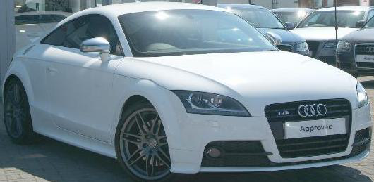
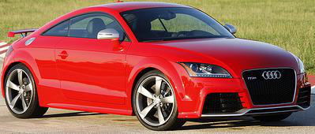
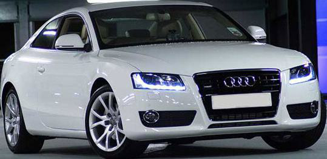
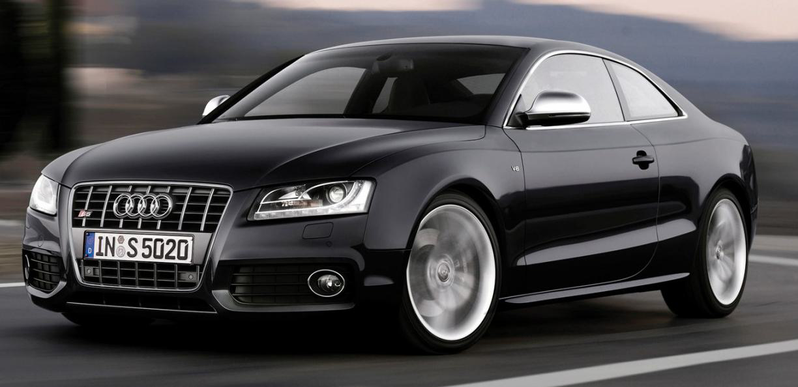
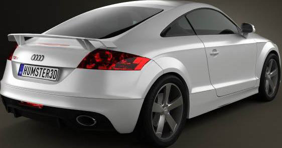
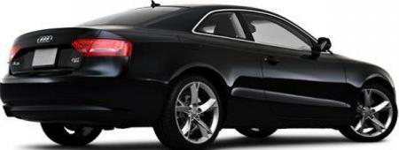

# Advanced Vehicle Classification for Enhanced Homeland Security

# Car Image Classifier with Fine-Tuned ResNet18

In line with **HTX's mission to harness cutting-edge technologies for safeguarding Singapore**, this project delivers a **computer vision solution** to accurately classify vehicle types from images. Designed for **Home Team departments** such as the **Singapore Police Force** and the **Immigration and Checkpoints Authority**, it enhances surveillance, traffic management, and security operations.

This solution will enhance real-time vehicle identification capabilities, improving surveillance and border control efficiency.
---

## Key Features

- **High-Precision Classification**: Fine-tuned **ResNet-18** model trained on the **Stanford Cars Dataset** to distinguish 196 car models with high accuracy.  
- **Real-Time API Integration**: FastAPI-based service enabling seamless integration for instantaneous vehicle identification.  
- **Scalable and Secure Deployment**: Docker containerization ensures easy deployment, scalability, and security across operational environments.

---

## Strategic Alignment

This project supports **HTX's commitment** to advancing science and technology within the **Home Team**, enhancing situational awareness and operational efficiency to safeguard Singapore’s safety and security.

---

## Table of Contents
1. [Project Overview](#project-overview)
2. [Dataset](#dataset)
3. [Directory Structure](#directory-structure)
4. [Setup and Installation](#setup-and-installation)
5. [Training the Model](#training-the-model)
6. [Running the API](#running-the-api)
7. [Results](#results)
8. [Acknowledgements](#acknowledgements)

---

## Dataset

The project uses the **Stanford Cars Dataset**, which contains 16,185 images of 196 car classes. 

Source: Kaggle - Stanford Cars Dataset
Contents:
Training Set: 8,144 images with annotations.
Testing Set: 8,041 images with annotations.
Metadata: Includes class names and bounding box coordinates for each image.
Classes: 196 distinct car models, ranging from sedans to SUVs, annotated with specific makes and models.
Image Resolution: High-resolution images, varying in size, with diverse backgrounds and lighting conditions.

**Assumptions Made**
Definition of "Car Type"
The term "car type" in the requirements has been interpreted to mean the full car make, model, and year (e.g., "Audi TTS Coupe 2012") rather than broad categories like "sedan," "convertible," or "hatchback." This assumption was made based on the use of the Stanford Cars Dataset, which provides highly granular labels for specific car models

- **Dataset Source (Images):** 
[Stanford Cars Dataset Images](https://www.kaggle.com/datasets/jessicali9530/stanford-cars-dataset?resource=download)
- **Dataset Source (Annotations):** [Stanford Cars Dataset Annotation] (https://www.kaggle.com/code/subhangaupadhaya/pytorch-stanfordcars-classification/input?select=cars_test_annos_withlabels+%281%29.mat)

```bash
data/
├── raw/
│   ├── standford-cars-dataset/       # Raw images (train/test)
│   ├── standford-cars-dataset-meta/  # Metadata (annotations)
├── processed/
│   ├── cropped_train/                # Cropped training images (generated by script)
│   └── cropped_test/                 # Cropped test images (generated by script)
```
## Directory Structure
```bash
project/
├── app/                                # API service code
│   ├── app.py                          # FastAPI application
│   ├── utils/                          # Utility functions
│   │   ├── data_loading.py             # Functions for loading and parsing data
│   │   ├── image_processing.py         # License plate detection and preprocessing
│   │   └── model_utils.py              # Model save/load utility
├── data/                               # Dataset folder (explained above)
├── mlruns/                             # MLflow experiment tracking logs
├── notebooks/                          # Jupyter Notebooks for model training
│   ├── train_model.ipynb               # Model training and evaluation
├── Dockerfile                          # Docker configuration
├── requirements.yaml                    # Python dependencies
├── README.md                           # This file
└── .gitignore                          # Ignored files
```

## Setup and Installation

1. Clone the repo
```bash
    git clone <insert github link>
```

2. Install conda environment

```bash
  conda env create -f environment.yml
  cd my-project
```

3. Check if Docker Is installed. Run the following command to check if Docker is installed. 

```bash
    docker --version
```
If Docker is installed, it will display the version number (e.g., Docker version 20.10.21, build 20fd1d6).

5. Verify Docker Daemon Is Running

```bash
    docker info
```
If the command fails, they need to start Docker. On macOS or Windows, this typically means opening the Docker Desktop application.


# Training the Model

1. Ensure the dataset is in the correct directory structure (see Dataset).
2. Run the Jupyter Notebook for training:
3. jupyter notebook notebooks/train_model.ipynb
4. Key steps in the notebook:
    - Data loading and preprocessing
    - Model fine-tuning with ResNet18
    - Experiment tracking with MLflow
    - Evaluation (confusion matrix, precision/recall)

# Running the API

1. Build and run the Docker container

```bash
    docker build -t stanford-cars-api .
    docker run -p 8000:8000 stanford-cars-api
```

2. Open your browser and navigate to:

```bash
    http://localhost:8000/docs
```
This opens the Swagger UI where you can interact with the API.
Use the /predict/ endpoint to upload an image for classification.

3. How you can call `/predict/` endpoint using Python

```bash
import requests

# Define the endpoint and the image path
url = "http://localhost:8000/predict/"
image_path = "path_to_your_image.jpg"

# Open the image file in binary mode
with open(image_path, "rb") as image_file:
    # Prepare the files payload
    files = {"file": image_file}
    
    # Send the POST request
    response = requests.post(url, files=files)

# Print the response
if response.status_code == 200:
    print("Predicted class:", response.json().get("predicted_class"))
else:
    print("Error:", response.status_code, response.json())
```

4.. How you can call `/predict/` endpoint using `curl`

```bash
curl -X POST "http://localhost:8000/predict/" \
     -H "accept: application/json" \
     -H "Content-Type: multipart/form-data" \
     -F "file=@path_to_your_image.jpg"
```

# Results

"Earlier experiments were conducted using a train-test split as the dataset sourced online had train and test set only. However, towards the end of the project duration, I realised this oversight, and I redid the data processing pipeline to use train-validation-test split. The final model used a proper train-validation-test split, ensuring more robust evaluation and generalization of the model's performance. The results in Table 2 reflect the most reliable metrics for comparison."

**Table 1: Results for experiments using train-test split**
    
| Model Architecture   | Frozen Layers        | Optimizer | Learning Rate | Weight Decay | Batch Size | Image Augmentation              | Dropout Rate | Best Train Accuracy | Best Val Accuracy | Best Train Loss | Best Validation Loss |
|-----------------------|----------------------|-----------|---------------|--------------|------------|---------------------------------|--------------|----------------------|-------------------|----------------|-----------------------|
| ResNet-18            | All                  | Adam      | 0.001         | -            | 32         | No                              | 0            | 83.2                | 36.9              | 0.827          | 2.78                 |
| ResNet-18            | All                  | Adam      | 0.001         | -            | 32         | No                              | 0.3          | 51.6                | 36.1              | 1.89           | 2.78                 |
| ResNet-18            | All                  | Adam      | 0.001         | -            | 32         | No                              | 0.5          | 31.8                | 33.6              | 2.9            | 2.89                 |
| ResNet-18            | All                  | Adam      | 0.001         | -            | 32         | Yes                             | 0            | 36.8                | 40                | 2.76           | 2.46                 |
| ResNet-18            | All                  | Adam      | 0.001         | -            | 32         | Yes                             | 0.3          | 19.2                | 31.2              | 3.78           | 3.00                 |
| ResNet-18            | Unfreeze layer 4     | Adam      | 0.001         | -            | 32         | Yes                             | 0            | 77.4                | 77                | 0.814          | 0.85                 |
| ResNet-18            | Unfreeze layer 4     | Adam      | 0.001         | -            | 32         | Yes                             | 0.3          | 75.2                | 78.2              | 0.893          | 0.816                |
| ResNet-18            | Unfreeze layer 4     | Adam      | 0.001         | 0.00001      | 32         | Yes                             | 0            | 73.1                | 75.8              | 0.974          | 0.862                |
| ResNet-18            | Unfreeze layer 4     | Adam      | 0.001         | 0.0001       | 32         | Yes                             | 0            | 74.2                | 75.5              | 0.941          | 0.896                |
| ResNet-18            | Unfreeze layer 4     | Adam      | 0.001         | 0.001        | 32         | Yes                             | 0            | 62.3                | 69.4              | 1.47           | 1.08                 |
| ResNet-18            | Unfreeze layer 4     | Adam      | 0.001         | -            | 32         | Yes + License Plate Blur        | 0            | 78.1                | 76.6              | 0.793          | 0.878                |


**Table 2: Results with Train-Validation-Test Split**

| **Model Architecture** | **Frozen Layers** | **Optimizer**                                                                 | **Learning Rate**                                                                                          | **Weight Decay** | **Batch Size** | **Image Augmentation** | **Dropout Rate** | **Best Train Accuracy** | **Best Val Accuracy** | **Best Test Accuracy** | **Best Train Loss** | **Best Validation Loss** | **Best Test Loss** |
|-------------------------|-------------------|------------------------------------------------------------------------------|-----------------------------------------------------------------------------------------------------------|------------------|---------------|------------------------|-----------------|-------------------------|-----------------------|------------------------|--------------------|-------------------------|--------------------|
| ResNet-18              | Unfreeze layer 4  | Adam                                                                         | 0.001                                                                                                     | -                | 32            | Yes                    | 0               | 78.1%                   | 75.4%                | 75.8%                 | 0.799              | 0.91                    | 0.943              |
| ResNet-18              | Unfreeze layer 4  | Adam                                                                         | 0.001 with ReduceLROnPlateau(optimizer, mode='min', factor=0.5, patience=2, verbose=True)                | -                | 32            | Yes                    | 0               | 80%                     | 79%                  | 78%                   | 0.724              | 0.795                   | 0.853              |

# Key Insights and Takeaways
Starting Point: Freezing all layers in ResNet-18 except the classification head (FC Layer), Learning Rate of 0.001, Adam optimizer and no dropout. Result: High Training Accuracy (Low Training Loss), but Training accuracy plateaued early (High Training Loss).

Subsequent Experiments:
- List of  changes made (Dropout rate, unfreezing layer 4, image augmentation, weight decay, ReduceLROnPlateau)

### Experiment Summary and Insights

| **Experiment**                                      | **Change Made**                          | **Reason**                                                | **Insight**                                                                 |
|-----------------------------------------------------|-----------------------------------------|----------------------------------------------------------|-----------------------------------------------------------------------------|
| **Baseline (Freeze Inner Layer, Train FC layer)**   | All layers frozen, no dropout           | Set Baseline                                             | Overfitting observed with high training accuracy and low generalization.    |
| **Experiment Group 2**                                    | Added dropout                           | Regularization technique to reduce overfitting           | Overfitting reduced (train-validation loss gap narrowed), but overall performance remained poor. |
| **Experiment Group 3**                                    | Enabled image augmentation              | Improve generalization                                   | Overfitting largely eliminated; however, both train and validation loss remained high, and accuracy was still unsatisfactory. |
| **Experiment Group 4**                                    | Unfroze layer 4                         | Allow feature extraction tuning                         | Significant improvement observed; model's discriminative power increased.  |
| **Experiment Group 5**                                    | Added weight decay (1e-4)               | Regularization to stabilize the model                   | Minimal impact observed, likely due to effective image augmentation already in place. |
| **Experiment Group 6**                                    | License plate blur augmentation         | Simulate real-world scenarios                           | No significant impact on model performance results.                         |
| **Experiment Group 7**                                    | Applied ReduceLROnPlateau (factor=0.5)  | Dynamically adjust learning rate to improve convergence | Validation loss plateaued in earlier epochs; dynamically reducing the learning rate helped achieve better optimization and improved performance. |


### Best-Performing Experiment
The best-performing model in the experiments was ResNet-18 with layer 4 unfrozen and trained using the Adam optimizer at a learning rate of 0.001 combined with ReduceLROnPlateau (factor=0.5, patience=2). This configuration, along with image augmentation and no dropout rate, achieved a train accuracy of 80%, validation accuracy of 79%, and test accuracy of 78%, with a train loss of 0.724, validation loss of 0.795, and test loss of 0.853.


### Visual Similarity Among Audi Models

**Misclassification from Confusion Matrix**
Computed the frequency table of misclassification amongst Audi Cars. Table below shows some samples:

| True Label         | Predicted Label      | Count |
|---------------------|----------------------|-------|
| Audi A5 Coupe 2012 | Audi S5 Coupe 2012   | 14    |
| Audi TT Hatchback 2011 | Audi TTS Coupe 2012 | 10    |
| Audi TT RS Coupe 2012 | Audi TTS Coupe 2012 | 8     |
| Audi A5 Coupe 2012 | Audi TTS Coupe 2012  | 3     |


| **Audi TTS Coupe 2012**                        | **Audi TT RS Coupe 2012**                    | **Audi A5 Coupe 2012**                      | **Audi S5 Coupe 2012**                      |
|------------------------------------------------|---------------------------------------------|---------------------------------------------|---------------------------------------------|
|  |  |  |  |
|  |  |  |  |


| **Audi TTS Coupe 2012**                        | **Audi TT RS Coupe 2012**                    | **Audi A5 Coupe 2012**                      | **Audi S5 Coupe 2012**                      |
|------------------------------------------------|---------------------------------------------|---------------------------------------------|---------------------------------------------|
|  |  |  |  |
|  |  |  |  |


## Some Commentary

**Audi TTS Coupe 2012 and Audi TT RS Coupe 2012**: The Audi TTS and RS share the same body kit, with the Audi TT RS having a spoiler. Due to the high visual similarity, the Precision, Recall and F1 score for are very poor with Audi TTS. 

The precision is very high for Audi TT RS, but the Recall is poor. The hypothesis is that if the image shows Audi TT RS with the spoiler, the model can classify correctly, but if it shows the car at other angles, it will miss it completely as it looks similar to the other Audi models like the Audi TTS.

**Audi A5 Coupe 2012 and Audi S5 Coupe 2012** The same goes with Audi A5 Coupe 2012 and Audi S5 Coupe 2012, with the only visual difference i can spot being the design of the front grille, bumpers or rims which are very small


## Future Improvements 
Given more time, I would explore alternative methods such as: 
- Using Deeper Architectures (ResNet 50)
- Use techniques like Grad-CAM to understand which features the model is focusing on and refine the dataset or augmentations to include underrepresented aspects.
- Explore augmenting the training set with more diverse images from varying angles and lighting conditions 
    - Example: For the Audi TTS Coupe 2012 and Audi A5 Coup 2012, most of the images were taken from the front only.